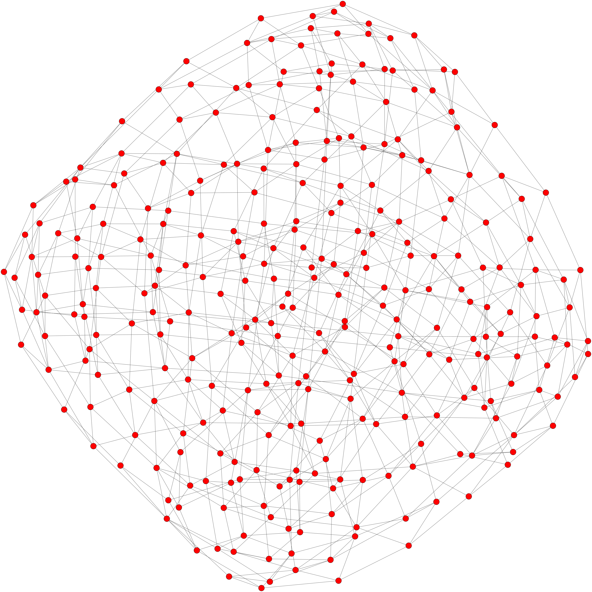

# Partial cubes
This repository includes some simple functions to work with partial cubes that I implemented as a PhD student. It also incudes a collection of all partial cubes up to a certain dimension. It is intended to be used with SageMath.

The code is not documented since it was inteneded only for private use; hopefully I will do this in the future.
Nevertheless, one can chech `get_stat.sage` for an example of usage. In file `partial_cubes_i5.txt` are written
all the partial cubes of isometric dimension at most 5, by their graph6 string epresentation.

Parial cubes of isometric dimension 6 are not uploaded to github, since the file is too big. They can be obtained on demand by sending a mail to tilen.marc@fmf.uni-lj.si

